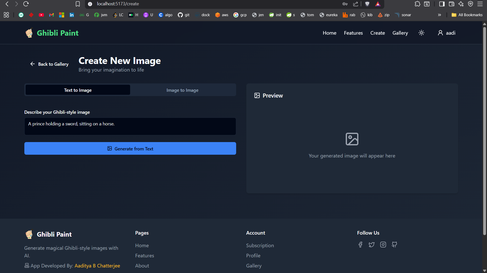
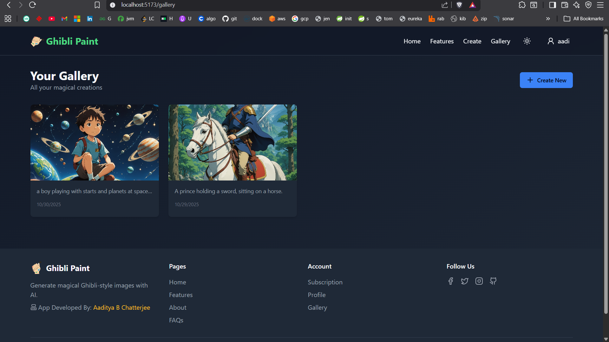

# Ghibli Paint Backend

**Ghibli Paint** is a full-stack web application that allows users to generate Studio Ghibli–style images using **text-to-image** and **image-to-image** generation powered by the [Stability AI API](https://platform.stability.ai/).  
Built with **Spring Boot**, **React (TypeScript)**, and **NeonDB**, it features **JWT-based authentication**, image storage, and an elegant modern UI for browsing your AI-generated artwork.

---


## Sample Screenshots
- Before clicking generate


- After generating in gallery



## 🏗️ Project Structure

```
# Backend

|── ghibli-paint-backend/        # Spring Boot backend (API + JWT + DB)
│   ├── src/main/java/org/aadi/ghibli_paint/
│   │   ├── controller/          # REST controllers
│   │   ├── entity/              # JPA entities
│   │   ├── repository/          # Spring Data repositories
│   │   ├── service/             # Business logic + Stability AI integration
│   │   └── security/            # JWT auth setup
│   ├── resources/
│   │   ├── application.properties
│   │   └── static/
│   ├── .env
│   └── pom.xml


#Frontend

|── ghibli-paint/            # React + TypeScript frontend
├── src/
│   ├── components/          # UI components (ImageCard, Tabs, etc.)
│   ├── hooks/               # Custom React hooks (useGallery, useGenerateImage)
│   ├── pages/               # Pages (Gallery, CreateImage)
│   ├── types/               # TypeScript interfaces
│   └── App.tsx
├── package.json
├── tsconfig.json
├── .env
└── vite.config.ts

```

---

## ⚙️ Features

### 🧠 AI Image Generation
- **Text-to-Image:** Generate Ghibli-style art from a text prompt.  
- **Image-to-Image:** Upload an existing image and transform it into a Ghibli aesthetic.

### 👤 Authentication
- **Plain JWT Authentication** for login/register.
- Tokens stored securely via frontend environment config.

### 🖼️ Gallery Management
- View your generated images in a personalized gallery.
- Download or delete images easily.
- Smooth animations with **Framer Motion**.

### 💾 Persistence
- Image metadata (prompt, filename, timestamps) stored in **NeonDB (PostgreSQL)**.
- Generated images stored locally or in cloud storage (depending on setup).

---

## 🧰 Technologies Used

| Layer             |                       Tech Stack                    |
|-------------------|-----------------------------------------------------|
| **Backend**       | Spring Boot, Spring Security, JPA/Hibernate, NeonDB |
| **Frontend**      | React, TypeScript, Vite, TailwindCSS, Framer Motion |
| **AI Generation** | [Stability AI API](https://platform.stability.ai/)  |
| **Auth**          | JWT (JSON Web Token)                                |
| **Build Tools**   | Maven (backend), Vite (frontend)                    |

---

## 🔐 Environment Variables

Both backend and frontend use `.env` files to manage secrets and configuration.

### Backend (`ghibli-paint-backend/.env`)
```

SPRING_DATASOURCE_URL=jdbc:postgresql://<your-neondb-url>
SPRING_DATASOURCE_USERNAME=<your-db-username>
SPRING_DATASOURCE_PASSWORD=<your-db-password>

JWT_SECRET=<your-jwt-secret>

STABILITY_API_KEY=<your-stability-ai-api-key>

IMAGE_STORAGE_PATH=./generated_images

```

### Frontend (`ghibli-paint/.env`)
```

VITE_API_BASE_URL=[http://localhost:8080/api](http://localhost:8080/api)
VITE_JWT_SECRET=<your-jwt-secret>

````

---

## 🚀 Running the Project

### 1️⃣ Clone the Repository
```bash
git clone https://github.com/<your-username>/ghibli-paint.git
cd ghibli-paint
````

### 2️⃣ Set Up Backend

```bash
cd ghibli-paint-backend
cp .env.example .env   # create your env file
./mvnw spring-boot:run
```

Backend runs on `http://localhost:8080`.

### 3️⃣ Set Up Frontend

```bash
cd ../ghibli-paint
cp .env.example .env   # create your env file
npm install
npm run dev
```

Frontend runs on `http://localhost:5173`.

---

## 🖼️ Example API Routes

| Method   | Endpoint                              | Description                        |
| -------- | ------------------------------------- | ---------------------------------- |
| `POST`   | `/api/images/generate/text-to-image`  | Generate image from text prompt    |
| `POST`   | `/api/images/generate/image-to-image` | Generate image from uploaded image |
| `GET`    | `/api/images/gallery`                 | Get user’s image gallery           |
| `GET`    | `/api/images/download/{id}`           | Download an image                  |
| `DELETE` | `/api/images/{id}`                    | Delete an image                    |


## 🧑‍💻 Development Notes

* **CORS** is enabled for all origins in `ImageController.java` for local development.
* The `StabilityAIService` handles communication with Stability AI’s REST API.
* Make sure to **store generated images** in a persistent directory (`IMAGE_STORAGE_PATH`).
* Add authentication middleware for user-based gallery isolation.

---

---

## 🧾 License

This project is licensed under the **MIT License** — see the [LICENSE](./LICENSE) file for details.

---

## 🧡 Credits

* **Studio Ghibli** for artistic inspiration.
* **Stability AI** for text-to-image & image-to-image models.
* Built by [Aaditya B Chatterjee](https://github.com/AadityaUoHyd).

````